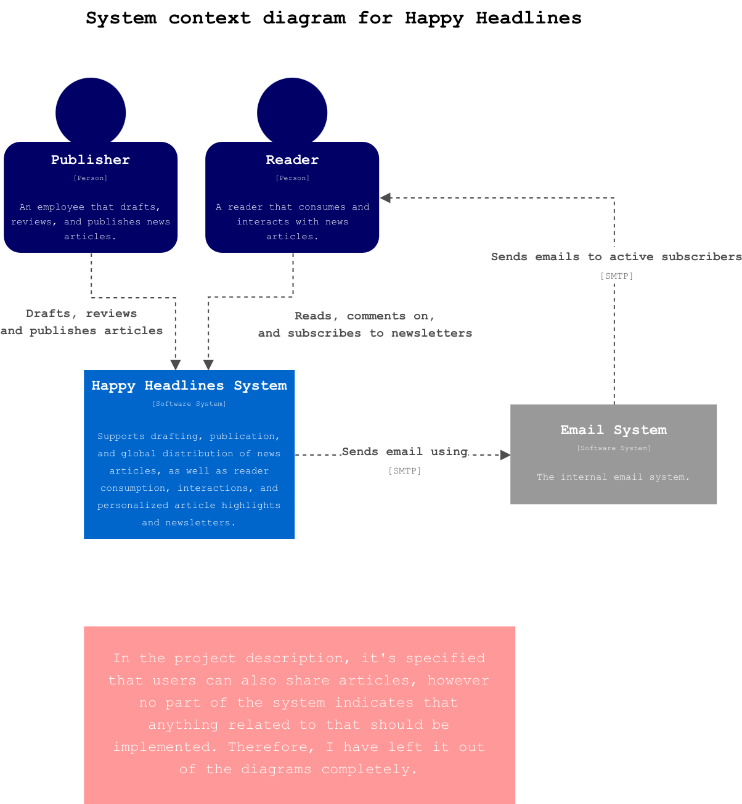
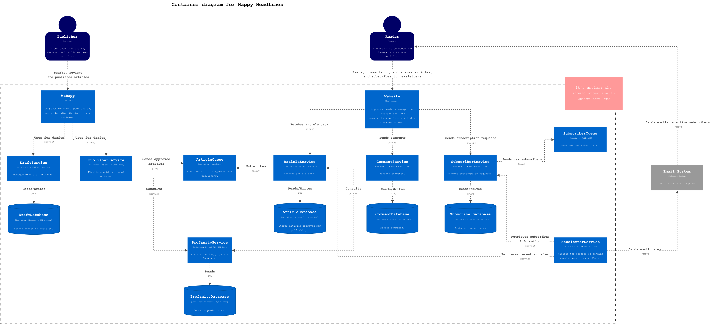
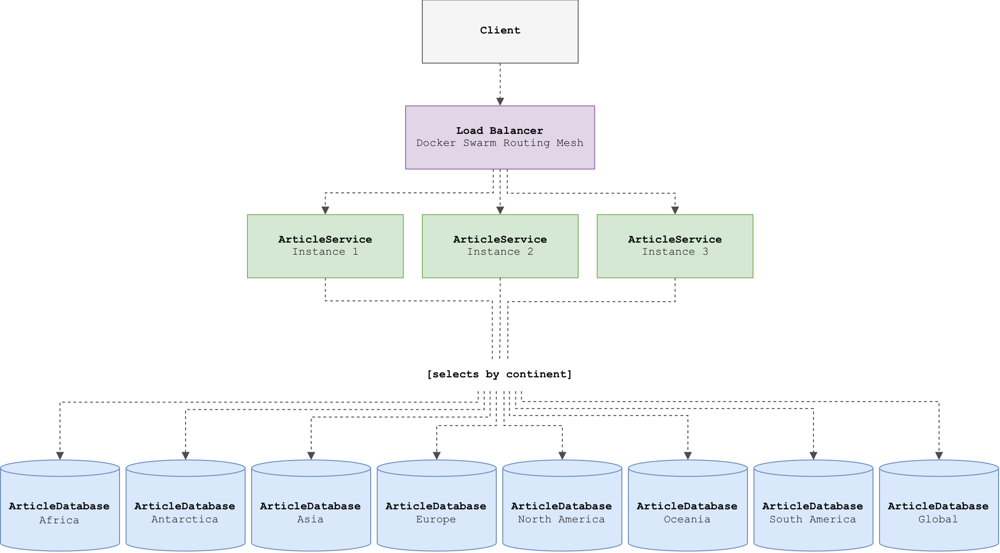

# Happy Headlines System

## C4 Diagrams
> Note: In the project description, it's specified that users can also share articles, however no part of the system indicates that anything related to that should be implemented. Therefore, I have left it out of the diagrams completely.

<picture>
  <source media="(prefers-color-scheme: dark)" srcset="./docs/figures/C4-system-context-diagram-dark.png">
  
</picture>

<br><br>

<picture>
  <source media="(prefers-color-scheme: dark)" srcset="./docs/figures/C4-container-diagram-dark.png">
  
</picture>

## ArticleService and ArticleDatabase Overview
<picture>
  <source media="(prefers-color-scheme: dark)" srcset="./docs/figures/article-architecture-diagram-dark.png">
  
</picture>
<br><br>

The `ArticleService` is horizontally scaled across three instances using Docker Swarm. Incoming requests are distributed between the available instances.  

The `ArticleDatabase` is split by continent, with one database for each continent and an additional global database for articles relevant worldwide.  

Each `ArticleService` instance can access all eight databases and routes database operations according to the continent specified by the request.

### API Endpoints
| Method | Endpoint | Parameters | Body | Description |
|---|---|---|---|---|
| `POST` | `/Articles/{continent}` | `continent` | `CreateArticleDto` | Create a published article in the specified continent database |
| `GET` | `/Articles/{continent}/{id}` | `continent`, `id` | — | Retrieve a published article |
| `PATCH` | `/Articles/{continent}/{id}` | `continent`, `id` | `UpdateArticleDto` | Update a published article |
| `DELETE` | `/Articles/{continent}/{id}` | `continent`, `id` | — | Delete a published article |

Valid `continent` values:
- `Africa`
- `Antarctica`
- `Asia`
- `Europe`
- `NorthAmerica`
- `Oceania`
- `SouthAmerica`
- `Global`

<br>

`CreateArticleDto` contains required fields:
```json
{
  "author": "string",
  "title": "string",
  "content": "string"
}
```

`UpdateArticleDto` contains optional fields:
```json
{
  "author": "string",
  "title": "string",
  "content": "string"
}
```

## Running the System with Docker Swarm
> Run the following commands from the project root

### Build Service Images
```bash
docker build -t article-service:latest -f ArticleService/Dockerfile .
docker build -t comment-service:latest -f CommentService/Dockerfile .
docker build -t draft-service:latest -f DraftService/Dockerfile .
docker build -t newsletter-service:latest -f NewsletterService/Dockerfile .
docker build -t profanity-service:latest -f ProfanityService/Dockerfile .
docker build -t publisher-service:latest -f PublisherService/Dockerfile .
```

### Initialize Docker Swarm
```bash
docker swarm init
```

### Deploy Compose File as a Swarm Stack
```bash
docker stack deploy -c docker-compose.yml happy-headlines
```

## Inspecting and Verifying the Project
### View Nodes
```bash
docker node ls
```

### View Services
```bash
docker stack services happy-headlines
```

### View Containers
```bash
docker ps
```

### View Service Replicas
```bash
docker service ps happy-headlines_<service>
```

### Verify Tables
```bash
docker exec -it <container-id> psql -U happy-headlines -d <database> -c "\dt"
```

### Verify Data
```bash
docker exec -it <container-id> psql -U happy-headlines -d <database> -c "SELECT * FROM <table>;"
```

## Stopping the Project
### Stop Stack
```bash
docker stack rm happy-headlines
```

### Delete Database Volumes
```bash
docker volume rm \
  happy-headlines_seq-data \
  happy-headlines_rabbitmq-data \
  happy-headlines_draft-database-data \
  happy-headlines_profanity-database-data \
  happy-headlines_comment-database-data \
  happy-headlines_article-database-africa-data \
  happy-headlines_article-database-antarctica-data \
  happy-headlines_article-database-asia-data \
  happy-headlines_article-database-europe-data \
  happy-headlines_article-database-north-america-data \
  happy-headlines_article-database-oceania-data \
  happy-headlines_article-database-south-america-data \
  happy-headlines_article-database-global-data 
```

### Leave Docker Swarm
```bash
docker swarm leave --force
```